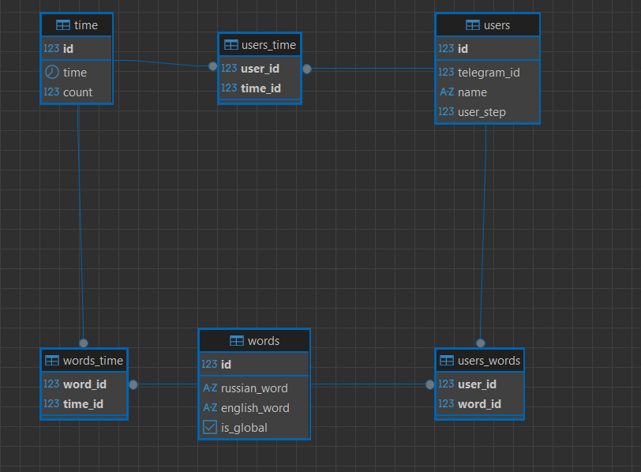

# Telegram Bot – Курсовой проект

## Описание проекта
Проект представляет собой Telegram-бота для изучения английских слов.

Основные функции:
- Автоматический перевод слов с русского на английский.
- Добавление новых слов для каждого пользователя.
- Учёт времени обновления слов и прогресса пользователя.

---

## Структура проекта

1. **bot.py** – основной файл с логикой работы бота.  
2. **token_keys.py** – файл с ключами и данными для подключения:
   - `token_bot` – токен Telegram бота.  
   - `token` – токен API Яндекс.Переводчика.  
   - `admin_name` – имя пользователя БД.  
   - `password_admin` – пароль.  
   - `ip_address` – IP сервера БД (`localhost`, если база локальная).  
   - `port` – порт подключения к БД.  
   - `basa_name` – имя базы данных.  

3. **orm_insert.py** – скрипт для создания таблиц и начального наполнения базы:
   - При запуске старые таблицы удаляются.  
   - Создаются новые таблицы.  
   - Добавляются 10 слов, доступных каждому пользователю.  

4. **translate_func.py** – функция автоматического перевода слов с русского на английский.

---

## Важные параметры
- **time_for_update** (в `bot.py`) – объект, отвечающий за время обновления слов.

---

## Схема базы данных

База данных состоит из:  
- `users` – информация о пользователях.  
- `words` – слова для изучения.  
- `time` – связь пользователя со словами.  
- Дополнительно: таблицы `users_words`, `users_time`, `words_time` для учёта времени изучения.

### Для импорта всех пакетов используйте 

pip install -r requirements.txt